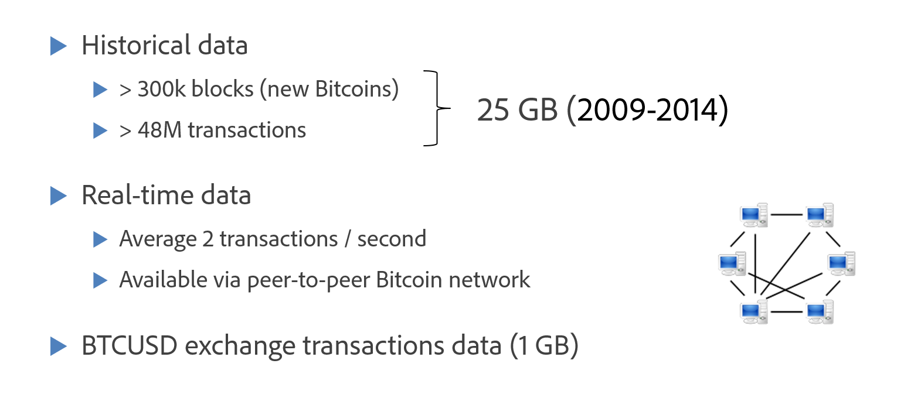
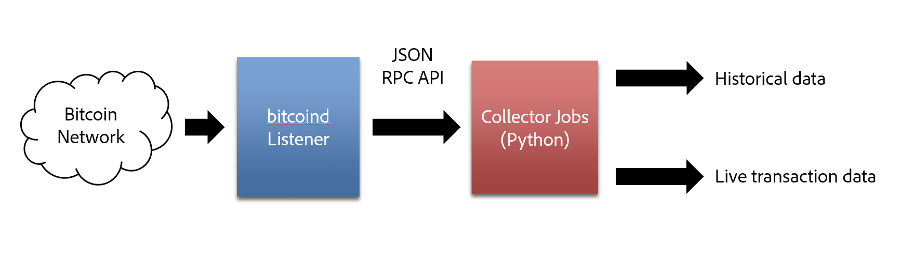
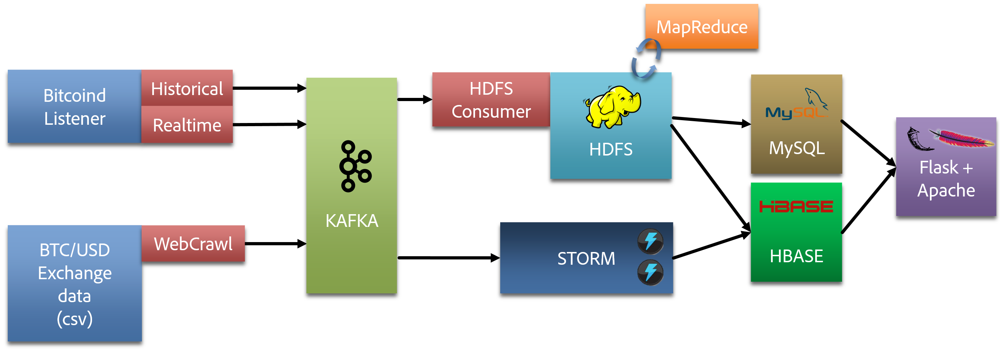
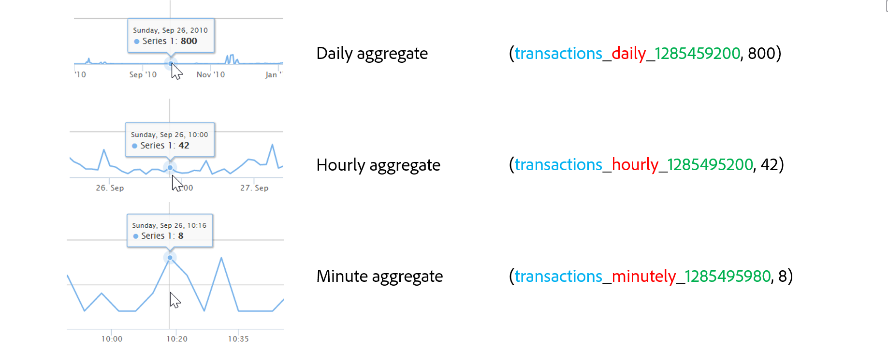
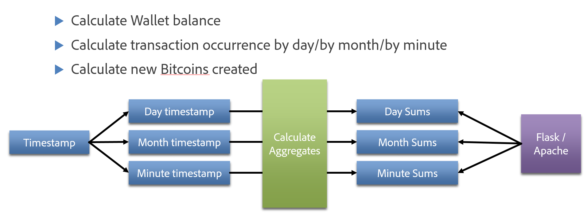
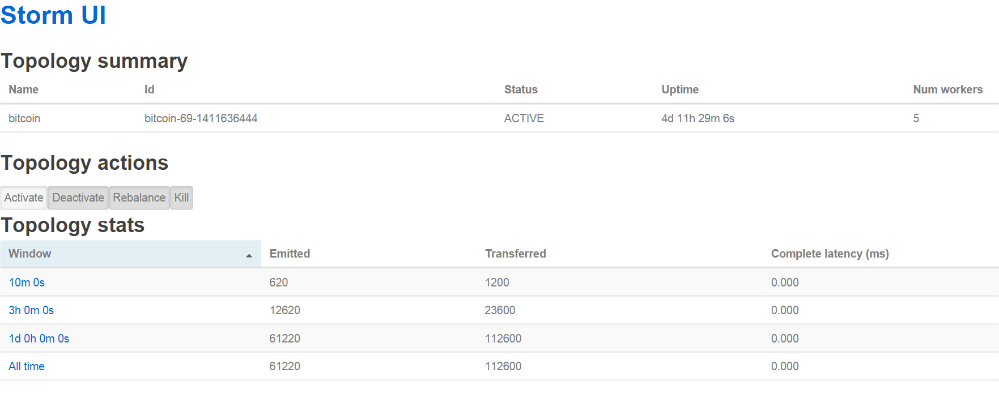

Bitcoin Inspector
=================

[Bitcoin Inspector](http://bitcoin-inspector.com) was my big data project as part of [Insight Data Science's](http://insightdataengineering.com/) Engineering fellowship program from September 2014 through October 2014


## Intro
**Bitcoin Inspector** is an open-source data pipeline that supports historical and live queries against the bitcoin network. It includes dynamic charts and visualizations with drilldown capabilities to explore bitcoin related data.
It makes use of the following technologies:
- Apache Kafka 0.8.1.1
- Apache Storm 0.9.2
- Apache Hadoop
- Yelp's MrJob mapreduce framework
- Apache HBase
- MySQL
- Flask with the following frameworks: HighCharts, jQuery, Bootstrap, metisMenu, Font Awesome, SBAdmin2 css theme

For an explanation of Bitcoin please visit [Khan Academy's explanation of Bitcoin](https://www.khanacademy.org/economics-finance-domain/core-finance/money-and-banking/bitcoin/v/bitcoin-what-is-it)

## Live Demo
A live demo is currently (September 2014) running at http://bitcoin-inspector.com
A [screencast](https://www.youtube.com/watch?v=ONI3STAHb0k) is also available on Youtube in case of a server downtime

Read further for more details about the project

## The Data
As of September 2014, the **Bitcoin block chain** (the transaction log since the creation of Bitcoin) is over 320k blocks long. On average a new block is added to the chain roughly every 10 minutes, and each block contains a list of transactions and also new bitcoins added to the pool (process of mining). The historical block chain data is over 25 GB in total and can be accessed by querying the bitcoin client.



## Connecting To The Bitcoin Network


The pipeline obtains data from the bitcoin client using a **JSON RPC API**. The bitcoin client allows querying for specific blocks (by hash and by block #) and responds with JSON formatted data. Python jobs (see bitcoin-client repository) is used to query periodically for missing blocks and transactions, and a realtime job also in Python monitors the memory pool of the client to detect new (unconfirmed) transactions.

Another Python job also polls exchange data from the [btc-e.com](http://btc-e.com) (Bitcoin Exchange) website for monitoring the exchange rate in various currencies.

## Pipeline Overview


The data from the bitcoin client is converted into [Protocol Buffers](https://code.google.com/p/protobuf/) to strip the json headers and validate the data, and base64 encoded to allow easier decoding by the mapreduce jobs. 
It is then sent to Apache Kafka in 3 separate topics:
- **bitcoin_blocks**: topic for historical block data
- **bitcoin_transactions**: topic for historical transaction data
- **realtime**: topic for realtime transaction data
- **bitcoin_exchange**: topic for exchange conversions from Bitcoin to other currencies (USD, RUR, EUR)

Hourly jobs then consume the data from the Kafka topics and save it directly into HDFS (see kafka_to_hadoop*.py). The files are tagged using a timestamp.


## Dynamic Time Range Keying


I implemented **3 levels of aggregation** for event aggregation (count of blocks, transactions, etc...). Creating **3 key/value pairs** out of each data point allows for querying the time series at different "zoom" levels. When pulling all data in a chart from 2009 to 2014, it is more efficient to pull daily aggregates because the data volume at a minute level from 2009 to 2014 would be huge and computationally intensive for HighCharts to render. After zooming in on a more precise range (ex: 2 months), we can use the hourly level aggregate key to obtain more granular data for a smaller interval. We do this again when zooming in on a 10 day interval where we are now interested in looking at the data by the minute.

To do this calculation I used **MapReduce jobs** that output 3 keys out of each timestamp (see Batch Processing diagram). The **Flask API** script dynamically selects which key to use based on the range of the query (less than 2 months => hourly, less than 10 days => minute). **Highcharts** automatically reloads the data and adjusts the upper and lower time bounds.

## Batch Processing


I used **Yelp's MrJob** project to run MapReduce jobs using Python. 
- **mapred_run_blocks.py**: load historical block data into **HBase**. Calculate daily/hourly/minute aggregates (sums) to enable charting new bitcoins created from 2009-2014
- **mapred_run_transactions.py**: load historical transaction data into **HBase**. Calculate aggregates the same way we do for the block history.
- **mapred_run_wallets/buckets.py**: Aggregate transaction flow for each Bitcoin address (in and out) to calculate the ending balance of the wallet. Save cardinality data into **HBase** and actual balance (5+ M records) in **MySQL** to support range querying.
- **mapred_run_exchange.py**: load exchange data and calculate aggregates the same way we do for the block history.
- **mapred_run_graph.py**: attempt at creating a wallet graph based on transaction data


## Realtime Processing


I used **Apache Storm** to provide real-time aggregates and do simple data processing.
- A single **Storm Spout** reads data from the Kafka "realtime" topic
- 1 **Storm Bolt** collects periodic metrics and statistics and stores them in HBase
- 1 **Storm Bolt** monitors incoming transactions and stores them in HBase. The table has a **TTL of 120s** which automatically clears old transactions.
- The Storm topology is loaded via **StreamParse**.


## Install And Setup:

Instructions are specific to Debian/Ubuntu.

Install required packages

```
sudo apt-get update
sudo apt-get -y install git build-essential autoconf automake libtool libboost-all-dev pkg-config libcurl4-openssl-dev libleveldb-dev libssl-dev libdb++-dev mailutils python-pip apache2 mysql-server php5 php5-mysql php5-curl php5-mcrypt maven protobuf-compiler cmake zlib1g-dev pkg-config libxml2-dev libxslt1-dev python-dev libmysqlclient-dev mysql-server libsqlite3-dev libldap2-dev libsasl2-dev libssl-dev curl
```

Update JAVA
```
wget --header "Cookie: oraclelicense=accept-securebackup-cookie" http://download.oracle.com/otn-pub/java/jdk/8u5-b13/jdk-8u5-linux-x64.tar.gz
sudo su
mkdir /opt/jdk
tar -zxf jdk-8u5-linux-x64.tar.gz -C /opt/jdk
update-alternatives --install /usr/bin/java java /opt/jdk/jdk1.8.0_05/bin/java 100
update-alternatives --install /usr/bin/javac javac /opt/jdk/jdk1.8.0_05/bin/javac 100
```

Install python packages.
```
sudo pip install protobuf happybase numpy mysql-connector-python mrjob streamparse
```

Install Kafka (see my [tutorial](https://github.com/ajmssc/kafka-insight-tutorial), Storm, and the Bitcoin client.


## Command Line Examples
Bitcoin client to Kafka:
```
python /home/admin/project/bitcoin/batch_load_blocks.py >> /home/admin/project/bitcoin/blocks.log
```

Kafka to HDFS
```
/usr/bin/python /home/admin/project/kafka/kafka_to_hadoop_blocks.py >> /home/admin/project/kafka/hourly_blocks.log
```

MrJob MapReduce
```
/usr/bin/python /home/admin/project/mrjob/mapred_run_wallets.py --file=/home/admin/project/mrjob/bitcoin_pb2.py  --hadoop-bin /usr/bin/hadoop -r hadoop hdfs:////data/bitcoin_transactions/*.dat >> /home/admin/project/mrjob/wallet.log
```

Load the Storm topology
```
cd storm/realtime_transactions && sparse submit
```

Apache ModWSGI to Flask configuration
```
<VirtualHost *:80>
                ServerName bitcoin-inspector.com
                ServerAdmin admin@soumet.com
                WSGIScriptAlias / /home/admin/project/flaskwww/flaskapp.wsgi
                <Directory /home/admin/project/flaskwww/app/>
                        Order allow,deny
                        Allow from all
                </Directory>
                Alias /static /home/admin/project/flaskwww/app/static
                <Directory /home/admin/project/flaskwww/app/static/>
                        Order allow,deny
                        Allow from all
                </Directory>
                ErrorLog ${APACHE_LOG_DIR}/error.log
                LogLevel warn
                CustomLog ${APACHE_LOG_DIR}/access.log combined
</VirtualHost>
```

/etc/mrjob.conf
```
runners:
  hadoop:
    hadoop_home: /usr/lib/hadoop-mapreduce
```


## Presentation Deck
My presentation slides are available at http://www.slideshare.net/Jeanmarcsoumet/bitcoin-data-pipeline-insight-data-science-project
